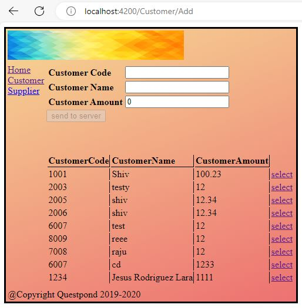

# CustomerApp

This project was generated with [Angular CLI](https://github.com/angular/angular-cli) version 17.0.7, to develop step by step the project of the Udemy course [Angular Step by Step for beginners](https://deloittedevelopment.udemy.com/course/angular-tutorial/)

This project contains a basic interface with the hability to navigate between menues and, add an retrieve from a json database with the help from node [json-server package](https://www.npmjs.com/package/json-server) . 

____________

## Initializing the project
1. download the git repo $git clone https://github.com/jrlara1127/AngularBegginers.git
2. open the CustomerApp folder on your CLI or bach, and execute $npm install to install the node packeges
3. Install json server dependecy $npm install -g json-server
4. put the *db.json* file outsite of the folder, open a new terminal and execute $json-server --watch db.json 
5. excecute the comand $ng server  on your folder terminal. Navigate to `http://localhost:4200/`. The application will automatically reload if you change any of the source files.
____________
## Build

Run `ng build` to build the project. The build artifacts will be stored in the `dist/` directory.
____________
## Running unit tests

Run `ng test` to execute the unit tests via [Karma](https://karma-runner.github.io).
____________
## Running end-to-end tests

Run `ng e2e` to execute the end-to-end tests via a platform of your choice. To use this command, you need to first add a package that implements end-to-end testing capabilities.
____________
## Further help

To get more help on the Angular CLI use `ng help` or go check out the [Angular CLI Overview and Command Reference](https://angular.io/cli) page.
